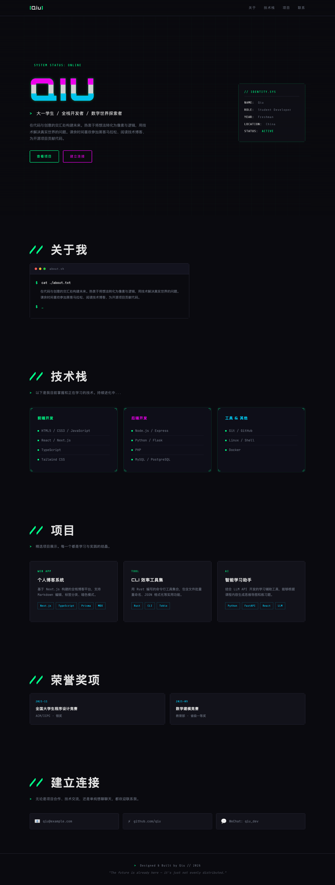
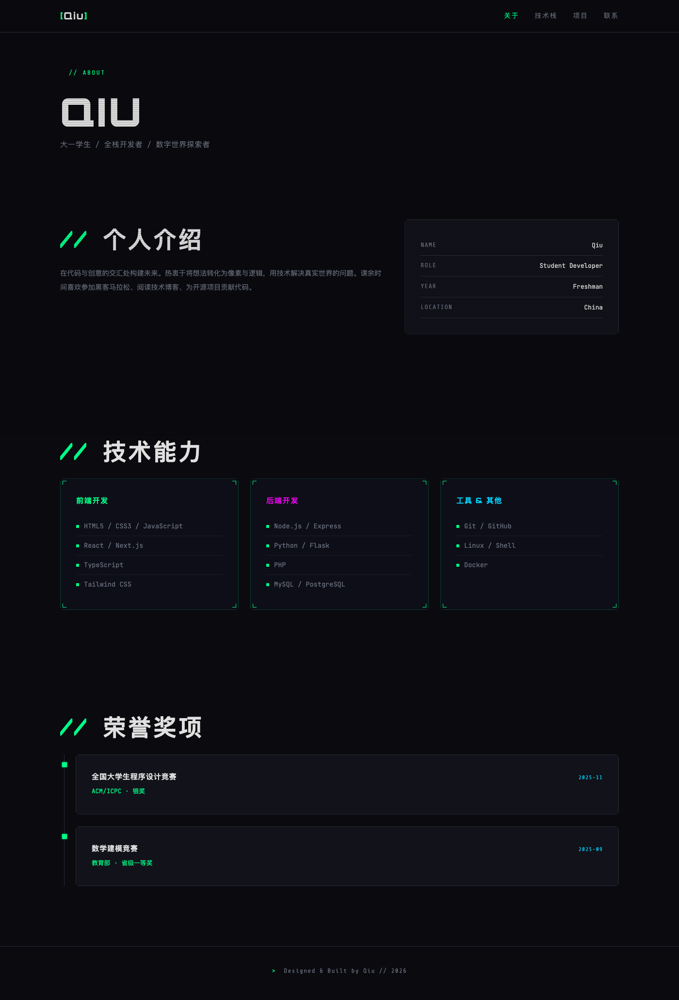
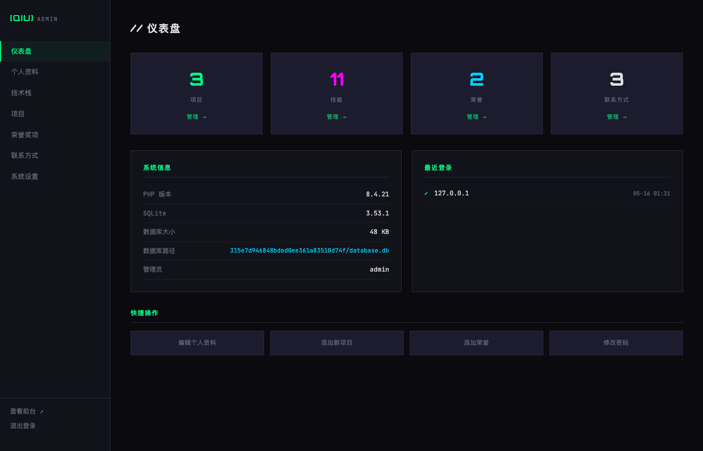
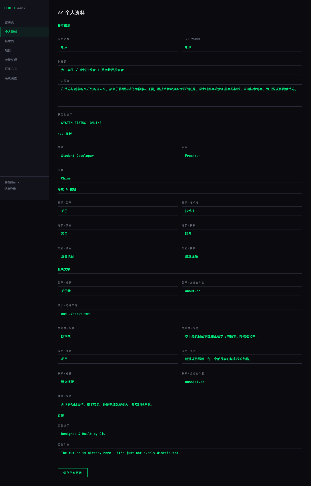

# CyberIndex

> 赛博朋克风格个人展示页 + PHP 后台管理系统

[English](#english) | 中文

---

## 预览

### 前台首页



### About 页面



### 后台仪表盘



### 后台编辑



---

## 简介

CyberIndex 是一个轻量级的个人展示页系统，采用赛博朋克/故障（Glitch）设计风格。前台呈现极具视觉冲击力的个人主页，后台提供完整的内容管理能力，所有文字均可通过后台自由编辑。

技术栈极简：PHP 8.3+ 原生开发，无任何框架依赖；SQLite 作为数据库，零配置部署。

## 特性

**前台**
- CRT 扫描线叠加、色差分离（Chromatic Aberration）、霓虹发光、切角卡片
- 多页面架构：首页、About（个人介绍 + 荣誉时间线）、Projects（列表 + 详情）、Contact
- 全部文字从数据库动态渲染，高度可定制
- 响应式设计，移动端友好
- `prefers-reduced-motion` 无障碍支持

**后台**
- 安装向导（环境检查 → 管理员配置 → 自动建库）
- 共享布局组件，统一侧边栏导航
- 完整 CRUD：个人资料、技术栈、项目、荣誉奖项、联系方式
- 仪表盘：数据统计、系统信息、登录日志、快捷操作
- 所有前台文字均可后台编辑（导航、按钮、标题、描述、页脚等）

**安全**
- Argon2id 密码哈希
- CSRF Token 防护
- PDO Prepared Statements（防 SQL 注入）
- XSS 输出转义
- IP 速率限制（5次/15分钟）
- 安全 Session（HttpOnly + Secure + SameSite=Strict）
- SQLite 存储在随机 32 位哈希目录下，防止路径猜测
- 安装完成后 install.php 自动锁定

## 环境要求

- PHP >= 8.3
- pdo_sqlite 扩展
- Argon2id 支持
- Nginx / Apache

## 快速开始

1. 将项目部署到 Web 服务器
2. 访问 `/install.php`，按向导完成安装
3. 访问 `/admin/` 登录后台，编辑内容
4. 访问 `/` 查看前台效果

## Nginx 伪静态参考

```nginx
location ~ ^/(data|core)/ { deny all; }
location ~ config\.inc\.php$ { deny all; }
location ~ \.(db|sqlite|sqlite3)$ { deny all; }
```

## 项目结构

```
├── index.php              # 前台首页
├── about.php              # About 页面
├── projects.php           # 项目列表 + 详情
├── contact.php            # 联系页面
├── style.css              # 前台样式
├── install.php            # 安装向导
├── .htaccess              # Apache 安全规则
├── .gitignore
├── core/
│   ├── config.php         # 配置加载
│   ├── db.php             # SQLite 连接（WAL 模式）
│   ├── functions.php      # CSRF、XSS、速率限制
│   └── session.php        # 安全会话
├── admin/
│   ├── index.php          # 登录 + 仪表盘
│   ├── auth.php           # 认证中间件
│   ├── layout.php         # 共享布局组件
│   ├── profile.php        # 个人资料编辑
│   ├── skills.php         # 技术栈管理
│   ├── projects.php       # 项目管理
│   ├── awards.php         # 荣誉奖项管理
│   ├── contact.php        # 联系方式管理
│   ├── settings.php       # 系统设置
│   └── assets/admin.css   # 后台样式
└── docs/                  # 截图
```

## 许可

MIT

---

<a id="english"></a>

## English

> Cyberpunk-styled personal portfolio + PHP admin panel

### Introduction

CyberIndex is a lightweight personal portfolio system with a cyberpunk/glitch design aesthetic. The frontend delivers a visually striking personal homepage, while the backend provides full content management — every piece of text is editable from the admin panel.

Minimal tech stack: vanilla PHP 8.3+ with no framework dependencies; SQLite as the database for zero-config deployment.

### Features

**Frontend**
- CRT scanlines, chromatic aberration, neon glow, chamfered corner cards
- Multi-page: Home, About (bio + awards timeline), Projects (list + detail), Contact
- All text dynamically rendered from database, fully customizable
- Responsive design, mobile-friendly
- `prefers-reduced-motion` accessibility support

**Admin Panel**
- Installation wizard (environment check → admin setup → auto database creation)
- Shared layout component with unified sidebar navigation
- Full CRUD: profile, skills, projects, awards, contacts
- Dashboard: stats, system info, login logs, quick actions
- All frontend text editable from admin (nav, buttons, titles, descriptions, footer, etc.)

**Security**
- Argon2id password hashing
- CSRF token protection
- PDO prepared statements (SQL injection prevention)
- XSS output escaping
- IP-based rate limiting (5 attempts / 15 minutes)
- Secure sessions (HttpOnly + Secure + SameSite=Strict)
- SQLite stored in randomized 32-char hash directory
- install.php auto-locks after installation

### Requirements

- PHP >= 8.3
- pdo_sqlite extension
- Argon2id support
- Nginx / Apache

### Quick Start

1. Deploy to your web server
2. Visit `/install.php` and follow the wizard
3. Visit `/admin/` to log in and manage content
4. Visit `/` to see the frontend

### License

MIT
